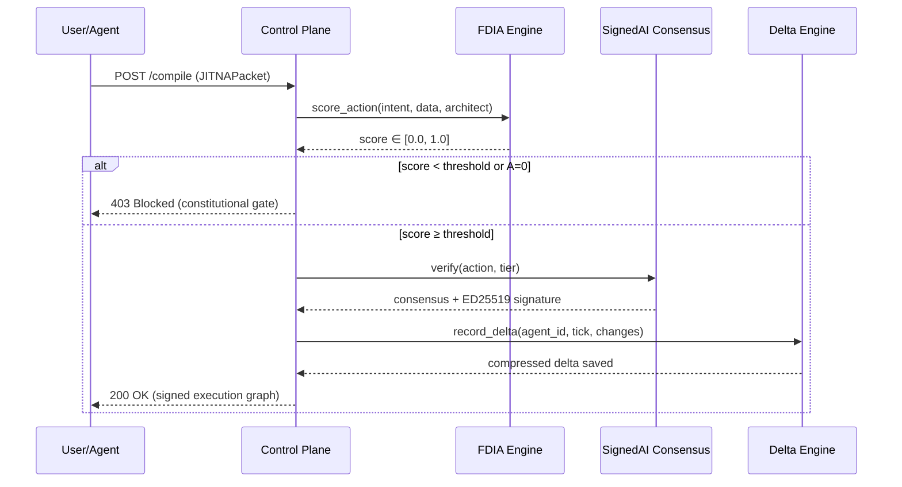

# Architecture Overview

**RCT Platform is organized as an 11-layer constitutional AI stack.**

---

## Layer Diagram

```
┌──────────────────────────────────────────────────────────┐
│               RCT PLATFORM SDK v1.0.1a0                  │
│         Intent-Centric AI Operating System               │
└──────────────────────────────────────────────────────────┘

Layer 11: CI/CD & Quality Gates
├─ GitHub Actions (ci.yml + security-scan.yml)
├─ 591 passing tests · 89% coverage · Python 3.10/3.11/3.12
└─ Bandit 0 HIGH · mypy 32 files clean

Layer 10: Enterprise Hardening
├─ Pre-commit hooks (black, isort, bandit)
├─ Semantic versioning (1.0.1a0)
└─ CITATION.cff · CODE_OF_CONDUCT.md · CONTRIBUTING.md

Layer 9: Regional & Compliance
├─ 8 regional pairs (TH, JP, KR, CN, VN, ID, TW, US)
├─ PDPA / PIPA / PIPL / GDPR adapters
└─ core/regional_adapter/

Layer 8: Reference Microservices (5)
├─ intent-loop         ← 7-state pipeline, FDIA gating
├─ analysearch-intent  ← GIGOProtector, adversarial self-refinement
├─ vector-search       ← FAISS + Qdrant backends
├─ crystallizer        ← concept graph, keyword extraction
└─ gateway-api         ← routing, CORS, health

Layer 7: Intent Loop Engine
├─ RECEIVED → VALIDATED → MEMORY_CHECK → COMPUTING
├─ → VERIFYING → COMMITTING → COMPLETED
├─ Cold start: 3–5s   Warm recall: <50ms
└─ rct_control_plane/intent_compiler.py

Layer 6: SignedAI Consensus
├─ S/4/6/8 tier framework
├─ ED25519 cryptographic attestation
├─ 7 HexaCore models (3 Western + 3 Eastern + 1 Thai)
└─ signedai/core/

Layer 5: Delta Engine
├─ 74% compression (stores diffs, not full state)
├─ SHA-256 per-record deduplication
├─ Full rollback to any past tick
└─ core/delta_engine/

Layer 4: FDIA Engine
├─ F = D^I × A  (constitutional equation)
├─ A=0 → full block (governance guarantee)
├─ Accuracy: 0.92 vs industry 0.65
└─ core/fdia/fdia.py

Layer 3: Control Plane DSL (15 modules)
├─ intent_schema · dsl_parser · execution_graph_ir
├─ policy_language · observability · replay_engine
├─ jitna_protocol · signed_execution · cli · api
└─ rct_control_plane/

Layer 2: JITNA Protocol (RFC-001 v2.0)
├─ Wire format: { I, D, Δ, A, R, M }
├─ Standard for cross-agent intent negotiation
└─ signedai/core/models.py

Layer 1: Core SDK Primitives
├─ IntentObject · ExecutionGraph · DSLParser
├─ FDIAScorer · SignedAIRegistry · MemoryDeltaEngine
└─ Exportable under Apache 2.0
```

---

## Data Flow — Single Intent Request



---

## Key Design Decisions

### Why the FDIA equation is not a config option
The equation `F = D^I × A` is enforced at the **mathematics level**. Governance is not a switch — when A=0, F=0 by arithmetic, not by condition check. This makes the guarantee **unforgeable**.

### Why deltas instead of state snapshots
Storing full agent state at every tick is O(n×t). Delta Engine stores only `changed_fields` with SHA-256 content hashing, achieving 74% compression on typical agent trajectories. Full rollback is still possible by replaying the delta chain.

### Why ED25519 over RSA
ED25519 signatures are 64 bytes vs RSA-2048's 256 bytes, verify 3× faster, and offer equivalent security. Critical for high-throughput multi-LLM consensus where thousands of decisions need attestation per second.
